# Frontend Mentor - Space tourism website solution

This is a solution to the [Space tourism website challenge on Frontend Mentor](https://www.frontendmentor.io/challenges/space-tourism-multipage-website-gRWj1URZ3). Frontend Mentor challenges help you improve your coding skills by building realistic projects.

## Table of contents

- [Overview](#overview)
  - [The challenge](#the-challenge)
  - [Screenshot](#screenshot)
  - [Links](#links)
- [My process](#my-process)
  - [Built with](#built-with)
  - [Continued development](#continued-development)
  - [Useful resources](#useful-resources)
- [Author](#author)
- [Acknowledgments](#acknowledgments)

## Overview

### The challenge

Users should be able to:

- View the optimal layout for each of the website's pages depending on their device's screen size
- See hover states for all interactive elements on the page
- View each page and be able to toggle between the tabs to see new information

### Screenshot

Mobile view
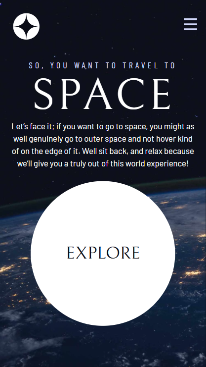
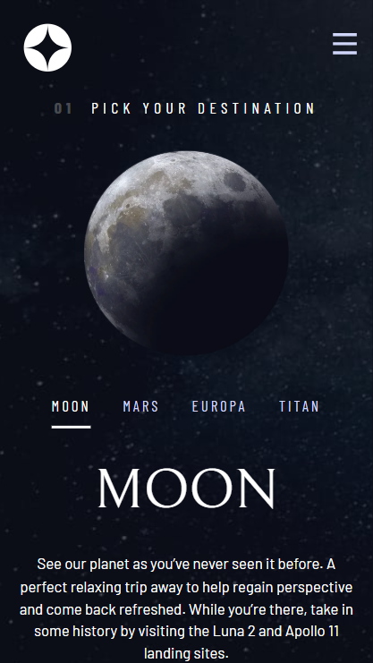
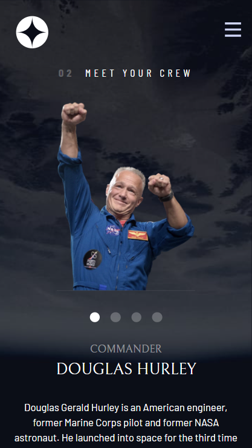
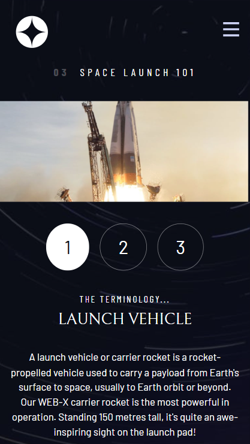

Tablet view
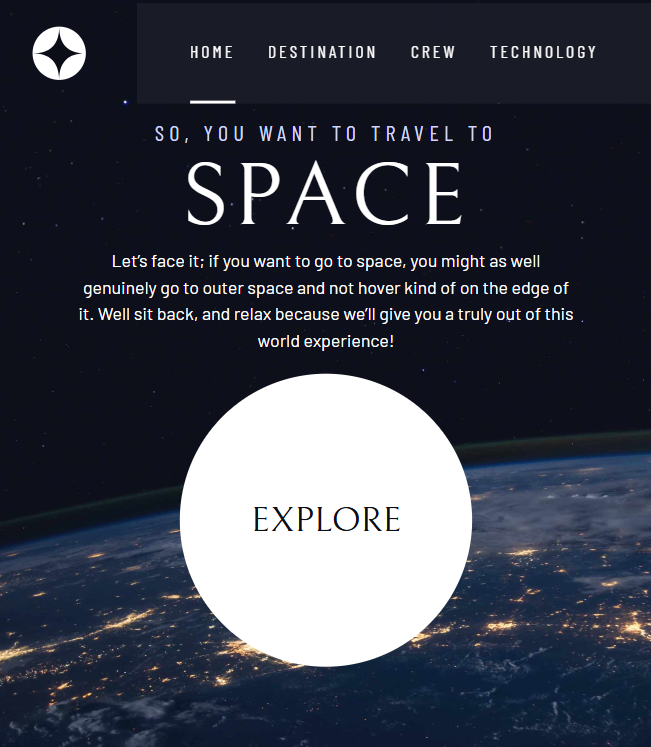
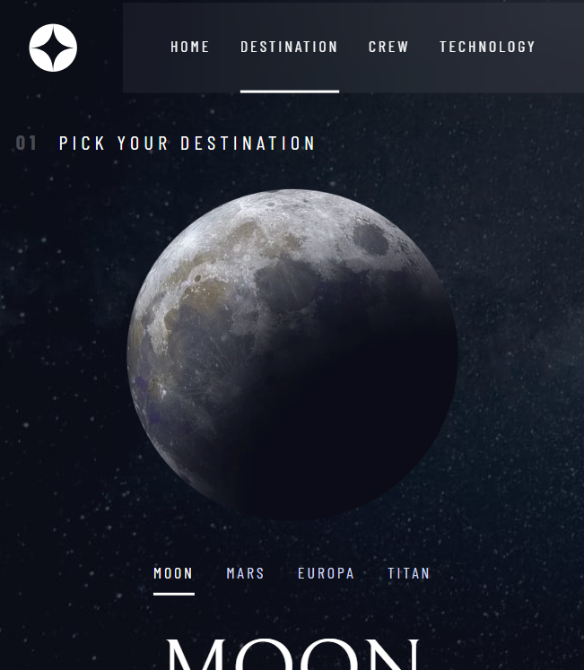
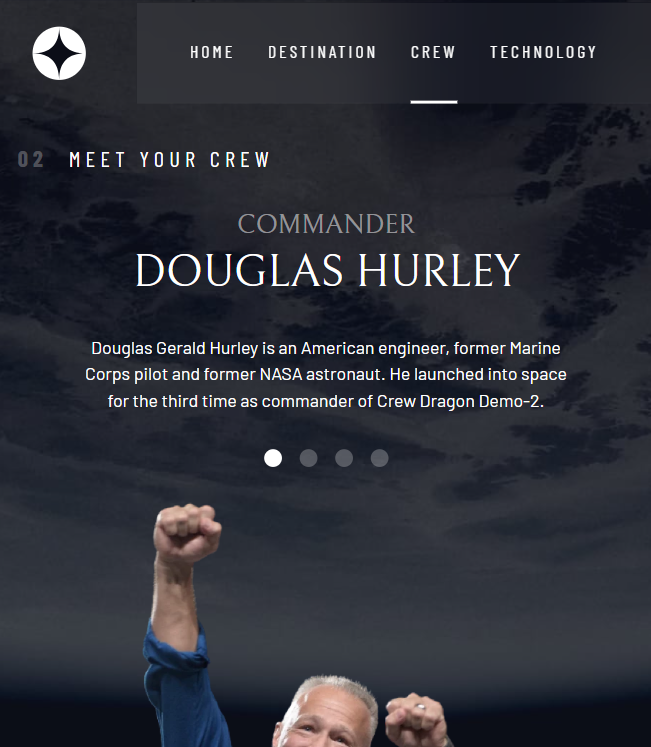
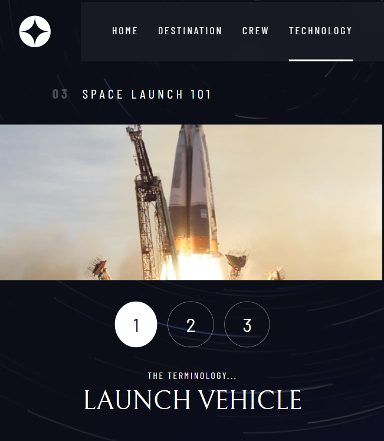

Desktop view
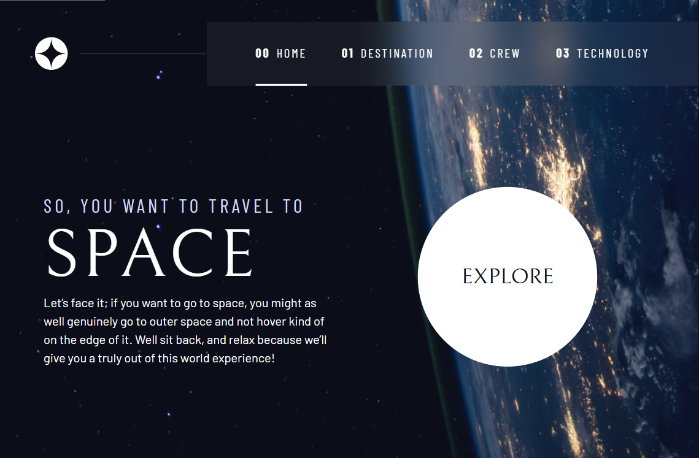
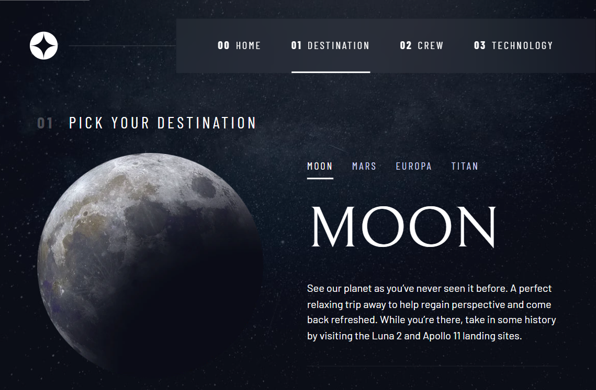
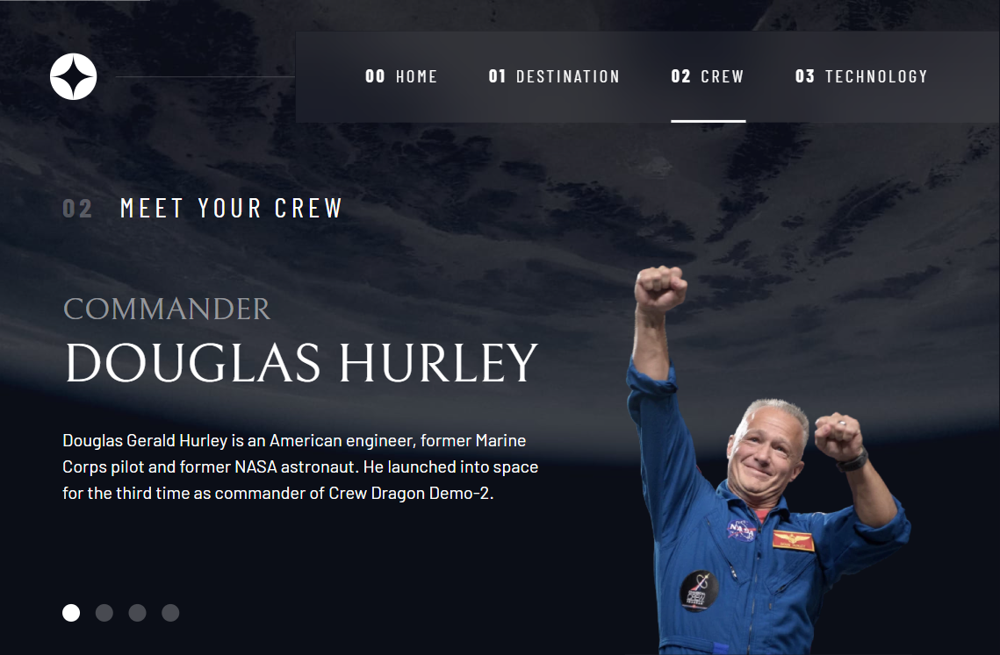
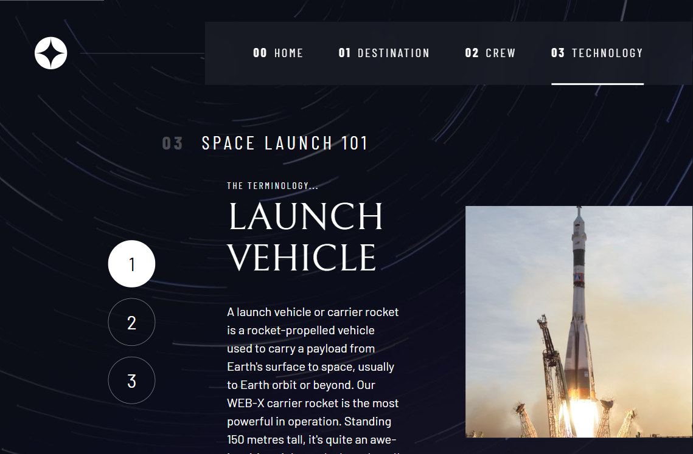

### Links

- Solution URL: [GitHub URL](https://github.com/akanji-00/space-tourism-website.git)
- Live Site URL: [Netlify URL](https://boisterous-kataifi-e7fa33.netlify.app/)

## My process

### Built with

- Semantic HTML5 markup
- CSS custom properties
- Flexbox
- CSS Grid
- Mobile-first workflow
- Javascript

### Continued development

Will be rebuilding in the future with React.

### Useful resources

- [Google Fonts](https://fonts.google.com/) - For the fonts used in the project. Very easy to plug-n-play.

## Author

- Frontend Mentor - [@akanji-00](https://www.frontendmentor.io/profile/akanji-00)
- Portfolio page still under construction.

## Acknowledgments

- Kevin Powell
- Scrimba
- YouTube
